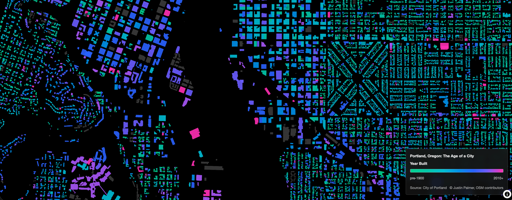

# New Age of the City



This repo rebuilds the original ["Age of the City"](https://labratrevenge.com/) visualization
by [Justin Palmer](https://github.com/caged)
using [PMTiles](https://github.com/protomaps/PMTiles) hosted on Cloudflare R2/Workers
and rendered with MapLibre GL JS.

## Data source

Portland's Building Footprints dataset includes a `YEAR_BUILT` field suitable for age-based styling.

- Portal: https://gis-pdx.opendata.arcgis.com/datasets/building-footprints
- Metadata: https://www.portlandmaps.com/metadata/index.cfm?action=DisplayLayer&LayerID=52413
- Coordinate system: Oregon State Plane North (NAD 1983);
  must be reprojected to WGS84 (`EPSG:4326`)

Key attributes:

| Field        | Type    | Description                  |
| ------------ | ------- | ---------------------------- |
| `YEAR_BUILT` | Integer | Construction year (nullable) |
| `BLDG_ID`    | String  | Unique building identifier   |
| `BLDG_USE`   | String  | Use category                 |
| `BLDG_SQFT`  | Integer | Square footage               |
| `NUM_STORY`  | Integer | Number of stories            |

> [!NOTE]
> `YEAR_BUILT` is missing for many features.
> This workflow keeps missing years and labels them as `unknown`.
> Pre-1996 data in Central City came from photogrammetry;
> post-2007 updates come from permits.

## Workflow overview

1. Download the building footprints (Shapefile recommended).
2. Run the preprocessing script to reproject, clean years, and generate NDJSON.
3. Build PMTiles with Tippecanoe.
4. Upload PMTiles to R2 and deploy the Cloudflare Worker.
5. Point MapLibre at the worker's tile endpoints.

## 0) Install dependencies

Install the required tools via Homebrew:

```bash
brew bundle
```

This installs:

- `uv` for Python dependency management
- `tippecanoe` for generating PMTiles
- `pmtiles` CLI for inspecting tilesets
- `caddy` for local development server

## 1) Python preprocessing

Run the script with `uv`:

```bash
uv run scripts/process_buildings.py \
  --input /path/to/Building_Footprints.shp \
  --output data/buildings_cleaned.ndjson
```

> [!NOTE]
> The script reprojects to WGS84,
> normalizes `YEAR_BUILT`,
> and creates `age_bucket`.
> Missing or invalid years become `-1` and map to `unknown`.
> You can override the current year used for validation:

```bash
uv run scripts/process_buildings.py \
  --input /path/to/Building_Footprints.shp \
  --output data/buildings_cleaned.ndjson \
  --current-year 2026
```

## 2) Build PMTiles with Tippecanoe

Install Tippecanoe (macOS):

```bash
brew install tippecanoe
```

Generate PMTiles:

```bash
tippecanoe \
  -o data/portland_buildings.pmtiles \
  -l buildings \
  -n "Portland Building Ages" \
  --projection=EPSG:4326 \
  -z18 \
  --drop-densest-as-needed \
  --extend-zooms-if-still-dropping \
  --coalesce-densest-as-needed \
  -y year_built -y age_bucket -y bldg_id \
  -P \
  -f \
  data/buildings_cleaned.ndjson
```

> [!NOTE]
> If tiles “stop loading” when you zoom in, it usually means your tileset’s max zoom is too low.
> Increase the `-z` value above (for example, `-z18`) and keep the map source `maxzoom` in
> `frontend/index.html` in sync with the same number.

Sanity check:

```bash
pmtiles show data/portland_buildings.pmtiles
```

## Local testing (no Cloudflare)

Use a local Caddy server to host both the HTML and the `.pmtiles` file.
This avoids CORS issues while still supporting HTTP `Range` requests.

```bash
brew install caddy
cd /path/to/repo
caddy file-server --root . --listen :8000
```

Open:

```
http://localhost:8000/frontend/index.html
```

In `frontend/index.html`, set `useLocalPmtiles = true` and use this URL:

```
pmtiles://http://localhost:8000/data/portland_buildings.pmtiles
```

This bypasses the Worker and lets you validate tiles locally before uploading.

## 3) Cloudflare R2 + Worker

This repo includes a Worker that proxies PMTiles from R2
and exposes standard `/{name}/{z}/{x}/{y}.mvt` URLs.

### Create an R2 bucket

```bash
wrangler r2 bucket create portland-tiles
```

### Upload PMTiles

Small files:

```bash
wrangler r2 object put portland-tiles/portland_buildings.pmtiles \
  --file=data/portland_buildings.pmtiles
```

Large files (using rclone):

```bash
rclone copyto data/portland_buildings.pmtiles \
  remote:portland-tiles/portland_buildings.pmtiles \
  --progress --s3-chunk-size=256M
```

### Configure and deploy the Worker

Edit `worker/wrangler.toml` to set your bucket name and preferred host:

```toml
name = "portland-tiles"
main = "src/index.ts"
compatibility_date = "2024-01-01"

[[r2_buckets]]
binding = "BUCKET"
bucket_name = "portland-tiles"

[vars]
ALLOWED_ORIGINS = "*"
CACHE_CONTROL = "public, max-age=86400"
PUBLIC_HOSTNAME = "tiles.yourdomain.com"
```

Deploy:

```bash
cd worker
npm install
npm run deploy
```

> [!IMPORTANT]
> Use a custom domain (not `*.workers.dev`) to enable Cache API.

### Validate caching

```bash
curl -I https://tiles.yourdomain.com/portland_buildings/13/1309/3169.mvt
```

Confirm `Cf-Cache-Status: HIT` on subsequent requests.

## 4) MapLibre GL JS demo

Open `frontend/index.html` and update the tiles URL if needed:

```
https://tiles.yourdomain.com/portland_buildings/{z}/{x}/{y}.mvt
```

The demo provides bucket-based styling
and a commented interpolate example for continuous gradients.

## Costs

- R2 storage: $0.015/GB/month
- Worker requests: free tier includes 100K requests/day
- A typical 100GB tileset runs around $3-5/month, depending on usage

## License and attribution

Respect Portland's open data terms and add attribution in your UI.
The default tiles are derived from Portland Bureau of Planning and Sustainability datasets.
